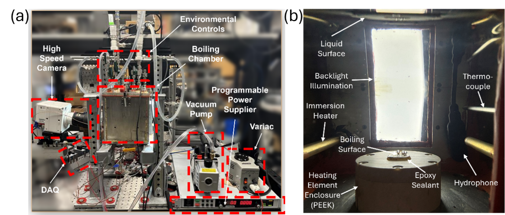

# Boiling Facility Hardware System

This folder is the shared hardware reference for the subatmospheric pool-boiling experiments represented in BoilingLab. It follows the AELab `ae-system` pattern: a visual system overview, an at-a-glance hardware table, and component notes that connect instruments and controls to recorded data products.

*Reported facility overview. The left image identifies the pressure-controlled vessel, environmental controls, high-speed camera, DAQ, DC supply, VARIAC, and vacuum pump. The right image shows the upward-facing boiling surface, immersion heater, LED backlight, thermocouple, hydrophone, and PEEK heating-element enclosure (HEE) in the chamber. Source: Hossain MSME thesis, Chapter 2, Figure 3; reused here with the thesis author's and supervising PI's permission.*

## System Summary

| Subsystem | Reported hardware | Function | Repository-facing output |
| --- | --- | --- | --- |
| Pressure-controlled vessel | CNC-machined 304 stainless-steel chamber, 200 x 180 x 180 mm internal volume, two 130 x 80 mm reinforced-glass viewports | Contains the DI-water pool; provides optical access and vacuum operation | Pressure, liquid-temperature, vapor-temperature, and video records |
| Vapor and temperature conditioning | Graham reflux condenser, internal coiled copper condenser, chiller, vacuum pump, two 250 W immersion heaters, VARIAC | Degassing, water-inventory recovery, saturation-temperature conditioning, and manual vapor-pressure regulation | Environmental-condition fields in the test log |
| Heating element enclosure | Three concentric PEEK structures, glass-mica ceramic, chopped-fiber insulation, OFHC/C101 copper block, nine 50 W cartridge heaters | Directs heat toward the 10 x 10 mm upward-facing boiling surface | Four embedded-copper thermocouple records and DC-power record |
| Temperature and pressure DAQ | NI cDAQ-9178; NI 9210 thermocouple modules; NI 9239 voltage module; PX409-030A5V pressure transducer | Acquires temperature and pressure through the custom facility LabVIEW VI | `Temperature.lvm`, `Pressure.lvm` |
| Heater-power control | MagnaDC SL200-7.5/UI+LXI supply and modified OEM VI | Applies and logs the transient step input; operator turns off power at CHF | `DC_power.lvm`, when available |
| Optical diagnostics | Phantom VEO 710L camera, Nikon 60 mm macro lens, rectangular LED backlight | Side-view boiling and bubble visualization | High-speed video or selected frames |

## System Notes

- [Facility and heating-element enclosure](facility-and-hee.md) documents the vessel, thermal path, test surface, working-fluid inventory, and interfaces.
- [DAQ, control, and imaging](daq-control-and-imaging.md) documents sensor channels, recorded rates, control responsibilities, imaging configuration, timebase limits, and the release boundary.
- [Experimental protocol](../docs/experimental_protocol.md) gives the preparation, degassing, conditioning, heat-load selection, and test sequence.
- [Data reduction](../docs/data_reduction.md) defines how acquired files are processed; the release does not reproduce the custom real-time LabVIEW calculations.

## Evidence and Use Boundary

Hardware identity, dimensions, operating settings, and figures in this folder are **reported thesis evidence** from Ishraq Hossain's supplied MSME thesis and defense presentation, not a present-day inventory, calibration certificate, electrical drawing, pressure-vessel qualification, or laboratory safety SOP. Manufacturer pages are linked in the component notes as supplemental product references; they do not prove the as-tested configuration.

The images are authorized thesis figures for this repository documentation. Do not reuse them outside this project without confirming the applicable author, publisher, and sponsor rights.
