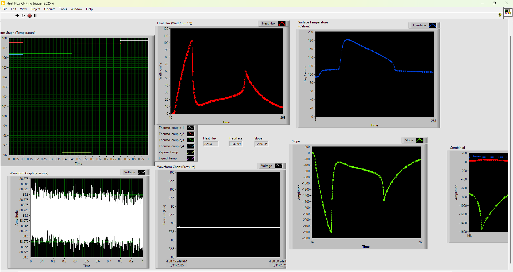
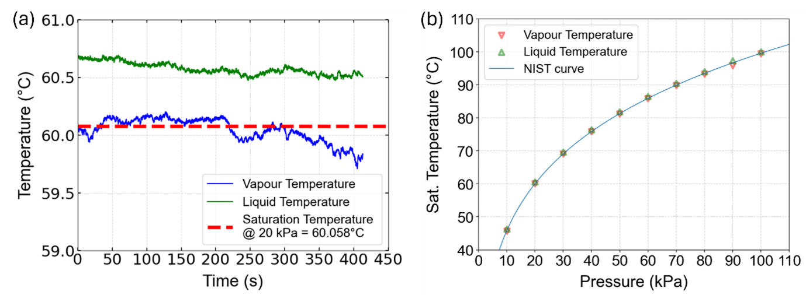
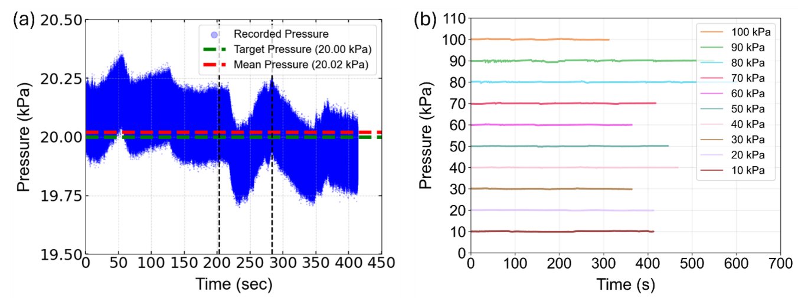
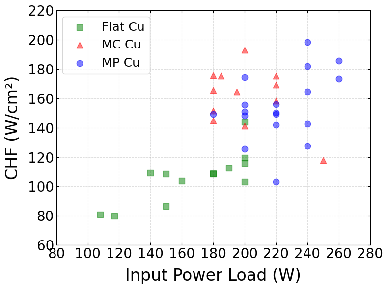

# DAQ, Control, and Imaging System

## Acquisition and Data Products

| Channel group | Reported hardware | Reported acquisition setting | Stored / analytical role |
| --- | --- | --- | --- |
| Copper block, liquid, and vapor temperature | NI cDAQ-9178 with NI 9210 modules and T-type thermocouples | NI 9210 maximum: 3.5 samples/s/channel; experiment logging: 3 Hz | `Temperature.lvm`; supports temperature-gradient fitting and environmental checks. |
| Vapor-space pressure | PX409-030A5V, BK Precision 1550 excitation supply, NI 9239 | NI 9239 maximum: 50 kS/s/channel; experiment logging: 25 kHz | `Pressure.lvm`; vapor-space pressure for saturation reference and stability screening. |
| Heater-power telemetry | MagnaDC SL200-7.5/UI+LXI and modified OEM VI | No released sampling rate or command log schema | `DC_power.lvm` when available; voltage, current, and input-power logging. |
| Side-view video | Phantom VEO 710L, Nikon AF-S Micro NIKKOR 60 mm f/2.8G ED, Advanced Illumination BT200100-WHIIC LED backlight | 512 x 512 pixels; thesis reports 150 and 300 frames/s | Bubble and vapor-state observations; retain test-specific setting in metadata. |

*Reported custom LabVIEW front panel. It displays raw sensor channels and real-time reconstructed heat flux, surface temperature, and slope. The yellow marker denotes the operator's CHF identification point for heater-power shutoff. Source: Hossain MSME thesis, Chapter 2, Figure 5.*

## Control Authority and Run Sequence

The reported setup separates environmental control, heater input, and acquisition. The immersion heaters and VARIAC condition the pool; the continuously running vacuum pump and internal-condenser coolant valve are manually adjusted to control vapor pressure; and the MagnaDC applies the selected one-step cartridge-heater input. The custom facility VI logs the thermocouples and pressure while displaying real-time surface-temperature and heat-flux estimates. A modified MagnaDC OEM VI controls and logs electrical input.

CHF is a **manual operator decision** in the documented workflow. At the real-time CHF signature, the operator turns off the MagnaDC power, then continues recording through post-CHF cooling and nucleate-boiling return. The repository does not establish an automatic shutdown, interlock, or alarm.

## Environmental-Control Evidence

*Reported liquid- and vapor-temperature traces and comparison with a NIST water saturation curve. The experimental target was liquid and vapor temperatures within +/- 1 deg C of the saturation temperature at the selected pressure. Source: Hossain MSME thesis, Chapter 2, Figure 6.*

*Reported pressure time histories. The experimental target was vapor pressure within +/- 0.5 kPa of setpoint. Manual valve adjustment creates visible local peaks and troughs; the target is not a per-sample uncertainty bound. Source: Hossain MSME thesis, Chapter 2, Figure 7.*

## Heat-Input Selection

*Reported open-chamber calibration showing CHF sensitivity to step input power. The main test load was selected slightly above the lowest load that could cause CHF for each pressure band and surface. Source: Hossain MSME thesis, Chapter 2, Figure 8.*

The intent is to avoid two failure modes: a load far above threshold, which can make the apparent CHF strongly affected by transient thermal inertia, and a load below threshold, which may never reach CHF. The selected electrical input is therefore a test-specific control variable, not a universal CHF value.

## Product References and Reproducibility Gaps

The following links are current manufacturer references checked on 2026-08-13; they supplement the thesis identity record rather than replace it.

- [NI cDAQ-9178 specifications](https://download.ni.com/support/manuals/374046a.pdf) and [NI C Series documentation](https://download.ni.com/pub/gdc/tut/c_series_documentation.html)
- [MagnaDC SL-series documentation](https://magna-power.com/assets/docs/html_sl/index-prodinfo.html)
- [Phantom VEO-family data sheet](https://www.phantomhighspeed.com/-/media/project/ameteksxa/visionresearch/documents/datasheets/web/wdsveofam.pdf?download=1)

Not released in this repository: LabVIEW source or executable files, NI-DAQmx task definitions and channel map, pressure-voltage scaling, calibration records, camera-calibration result, trigger wiring, clock-drift budget, MagnaDC command settings, and electrical/pressure safety implementation. Consequently, images and `.lvm` products make the experiment interpretable, but do not yet make its acquisition/control stack independently reproducible.

Before a future code release, add the VI project and dependency versions, an I/O map with units and safe states, calibration provenance, a non-energized dry-run mode, representative raw files, precise start/trigger/timebase semantics, and a test that demonstrates the intended shutdown authority.
