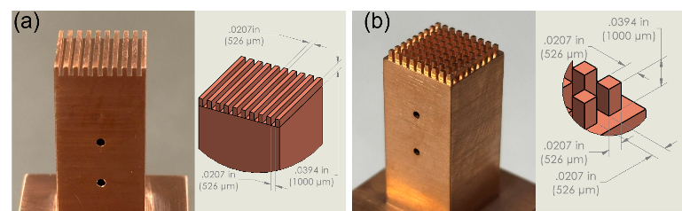

# Facility and Heating-Element Enclosure

## Pressure-Controlled Pool-Boiling Facility

The reported chamber is fabricated from 1/2 in-thick 304 stainless-steel plates with an internal volume of 200 x 180 x 180 mm. Silicone gaskets, toggle clamps, bar clamps, and bolted interfaces were used to establish the vacuum-tight enclosure. Two opposed reinforced-glass viewports (130 x 80 mm) provide side-view optical access. The ceiling provides fluid-fill, vacuum, reflux-condenser, and internal-condenser connections; the base provides a 66 mm HEE opening and a drain-valve connection.

### Environmental-control hardware

| Component | Reported configuration | Function and boundary |
| --- | --- | --- |
| Reflux condenser | Ace Glass 5953 106 Graham condenser; nominal 10 deg C cooling water | Condenses vapor/gas leaving the pool during degassing and boiling; condensate returns by gravity. |
| Internal condenser | Coiled copper-tube heat exchanger near the ceiling; coolant flow adjusted with a Swagelok SS-4L-MH Vernier metering valve | Fine manual condensation control while keeping the free surface below the coil. |
| Chiller loop | Thermo Scientific 223432800; 1/2 in-OD transparent PVC tubing, bypass loop, and quarter-turn valves | Supplies both condenser paths. Chiller setpoint and flow rate are not released in this repository. |
| Vacuum system | Tingwei TW-1.5A vacuum pump with 68 cSt synthetic oil | Runs continuously; its valve is manually adjusted together with condenser flow to control vessel pressure. |
| Pool heaters | Two McMaster-Carr 4668T54 screw-plug immersion heaters, 250 W each, at 38 mm height; Staco 3PN1010B VARIAC | Used to degas and condition the pool. They are not the cartridge-heater heat input used for boiling curves. |
| Bulk measurements | Two T-type threaded thermocouples (McMaster-Carr 1245N16) and a DwyerOmega PX409-030A5V pressure transducer | Lower thermocouple: liquid pool; upper: vapor space. Pressure is measured in the vapor space, not locally at the heater. |



*Reported C101 copper test-surface configurations and nominal design drawings. The source figure is the controlling record for feature dimensions; do not infer tolerances, roughness, or as-built dimensions from this rendered image. Source: Hossain MSME thesis, Chapter 2, Figure 4.*

## Heating Element Enclosure and Thermal Path

The custom HEE is a nested PEEK enclosure with a glass-mica ceramic support and chopped-fiber insulation around the copper block. Its intended thermal function is to suppress radial losses and favor one-dimensional conduction along the central axis toward the exposed surface. The rear ceramic layer thermally isolates the copper block from PEEK.

| Element | Reported specification | Analysis relevance |
| --- | --- | --- |
| Test material and orientation | Oxygen-free C101 copper; horizontal, upward-facing | Three surface types: flat, straight microchannel, square micro-pin-fin. Structured-surface results are base-temperature metrics. |
| Exposed boiling area | 10 x 10 mm | The nominal area used to interpret reported heat flux; confirm the active-area convention before changing calculations. |
| Heater bank | Nine DwyerOmega HDC19102 cartridge heaters, 50 W each | Driven by the MagnaDC supply for a single transient step input. Electrical input is not assumed equal to surface heat flux. |
| Embedded thermocouples | Four T-type DwyerOmega TJ36-CPSS-032U-6; approximately 0.9 mm-diameter, 5 mm-deep holes | Tips lie on the centerline. Nearest tip is approximately 5.5 mm below the interface; 2.54 mm axial spacing supports the linear-fit reconstruction. |
| Perimeter seal | Momentive RTV 106 high-temperature silicone inner layer and 3M DP 110 epoxy outer layer | Limits leakage and unwanted edge nucleation, but no released leak-rate or seal-qualification result is available. |

## Operating Geometry and Pressure Reference

The chamber was filled to roughly half its internal height (approximately 100 mm), yielding about a 70 mm water column above the copper surface while keeping the free surface below the internal condenser coil. Reported pressure is vapor-space pressure. The thesis estimates the corresponding hydrostatic increment at the heater to be below 0.7 kPa; it is most consequential at the lowest target pressure and should not be silently discarded in a local saturation-temperature sensitivity study.

### Facility Interfaces

```text
chiller -> reflux condenser + internal coil -> condensate / pressure control
vacuum pump -> chamber vapor space -> manual pressure control
VARIAC -> immersion heaters -> pool temperature and degassing
MagnaDC -> cartridge heaters -> copper block -> boiling surface
DAQ + facility VI <- thermocouples and pressure transducer
camera + LED <- viewport <- side-view bubble field
```

This block is an information-flow summary, not a wiring diagram. Electrical ratings, grounding, over-current protection, pressure relief, and interlocks are not established by the released thesis figures and must be checked from the actual laboratory hardware before operation.
